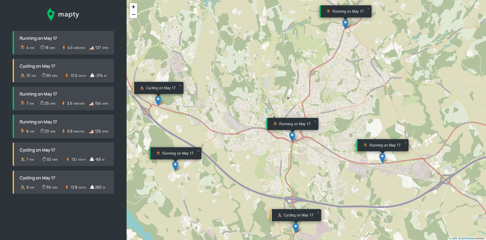

# Mapty

<div align='center'>

  


</div>



You can view the live site -> [Here](https://mapty-imad.netlify.app/)

## Usage

To make this web application work, you need to give location permission for this site.

## Description

Mapty is a web-based workout tracking application that utilizes geolocation and the Leaflet library. With Mapty, you can select the type of activity (running or cycling) and enter workout details directly on the map.

## Features

- Track your workouts by recording the following metrics: Location, distance, time and other relevant metrics.
- Choose between running or cycling as the type of activity.
- Visualize your workouts on a map with distinct markers for each activity type.

- Access a comprehensive list of all workouts, including details such as: distance, time, speed, and elevation gain
- Saving workout data to local storage, persistence the data even after closing the browser.

## Technologies Used

- HTML5
- CSS3
- JavaScript

## Installation

To run this project locally, you can follow these steps:

1. Clone the repository:

   ```
   $ git clone https://github.com/imadosan/Mapty.git
   ```

2. Open the project folder in your code editor of choice.
3. Open the 'index.html' file in your web browser.

## License

This project is licensed under the MIT License.

## Contact

If you have any questions or comments about this project, you can reach out to me at imad.fayad.if@gmail.com
